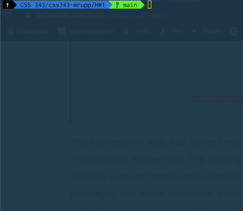
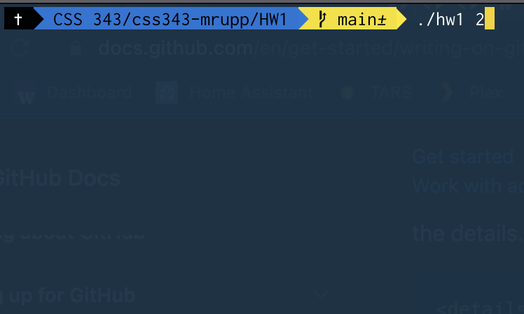
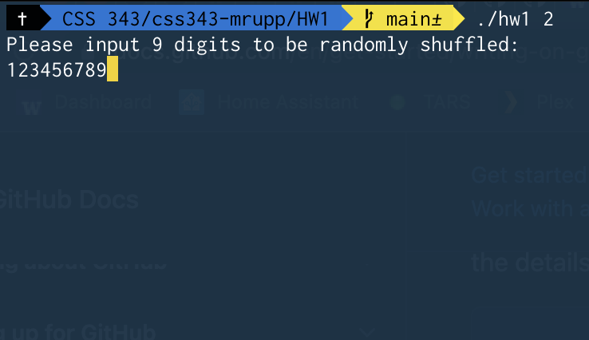
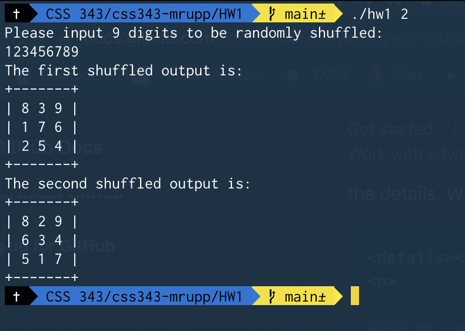

# Homework 1 - Mathew Rupp
---
## About The Assignment
<p align="center">
  
</p>

The goal of this project is to set up our github for this class, setup our coding environment, and review basic C++ syntax

## Compiling The project
---
This project uses standard library features that require it be compiled using C++ 11 or above. To compile, either use `;g++ -std=c++11 -o hw1 source/hw1.cpp` or simply run `bash build.sh`

## Running The Project
---
*This project requires an argument be passed in. Failure to pass in an argument will result in a segmentation fault.*

After building this project, you may run it by typing `./hw1 {Integer}` where `{integer}` is replaced by an integer that is greater than 0 and less than or equal to 10. 

The program will ask you for an input of **nine** digits. *note, this must be exactly nine digits* 

The program will then shuffle the order of the digits and display them in a 3x3 grid. This will repeat as many times as were specified via the argument passed in when the program is executed.

## Common Issues
---
<details><summary>I get a Segmentation Fault When Running</summary>
<p>
This is usually caused by not providing an argument when running the program. Ensure you have a parameter after the executable name. Example: <code>./hw1 2</code>.
</p>
</details>
<details><summary>I get random characters in my output</summary>
<p>
Ensure you input has 9 digits</p>
</details>
 
<details><summary>The Program Aborts after running</summary>
<p>
Your input has more than 9 digits
</p>
</details>

## Example
---
1. We decide we want to shuffle our numbers twice. We run `hw1` with the argument `2`. `./hw1 2`


2. The program prompts us to input nine digits to be randomly shuffled. We input `123456789`.


3. The program outputs our shuffled digits in a 3x3 grid.


## FAQ
---
Q: Why do I need to use `g++ -std=c++11` to build this?

A: I decided to use a map to get the language for the output.
```
void uiHelper(int i){
  map<int, string> shuffleOutputText {{ 1, "first"}, { 2, "second" }, { 3, "third" }, { 4, "fourth" }, { 5, "fifth" }, { 6, "sixth" }, { 7, "seventh" }, { 8, "eighth" }, { 9, "ninth" }, { 10, "tenth" }};
cout << "The " << shuffleOutputText[i] << " shuffled output is: " << endl;
}
```
---
Q: Why Did You Use printf instead of cout?

A: Because we were printing out characters in an array, it was cleaner to code. For Example:
```
printf("| %c %c %c |\n",arr[0],arr[1],arr[2]);
```
would look like:
```
cout << "| " << arr[0] << " " << arr[1] << " " << arr[2] << " |" << endl
```
---
Q: What happens if I type characters instead of digits?

A: The program breaks. The constraints of the assignment stated:
"The program takes the string of 9 digits through console input. It should prompt the user to type in the string of 9 digits."

It would be possible to code tests to check the input for type and to ensure that exactly nine digits are input, but that seems to be beyond the scope of the assignment.

---
Q: How did you randomize the shuffle?

A: I used the standard library `random_shuffle` function. 
```
  random_shuffle(arr,arr+9,randomSeed);

```
To randomize it, I used a randomSeed function to generate a random integer. The randomSeed function took an input of `unsigned(time(0))`.

## Thank You
