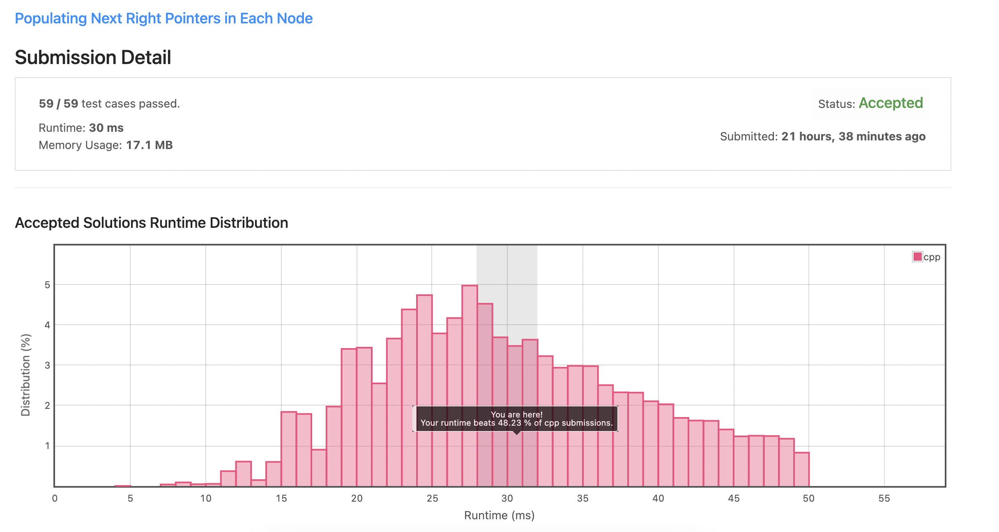
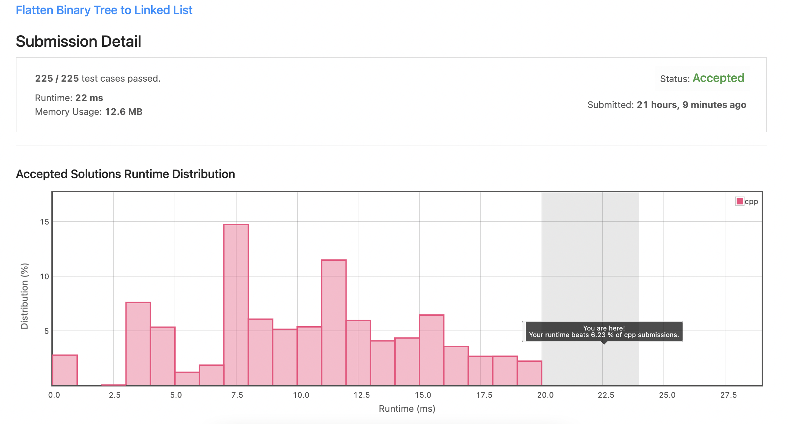
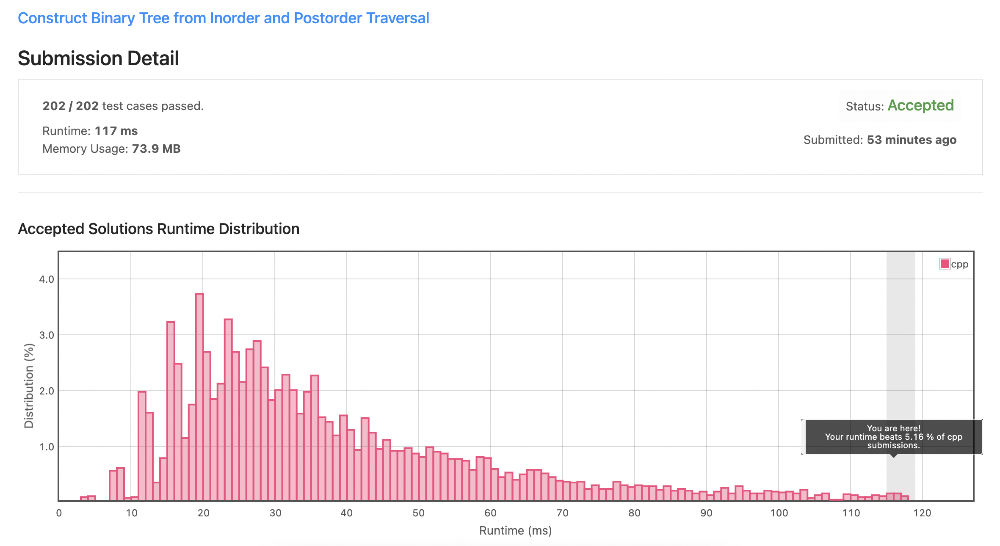
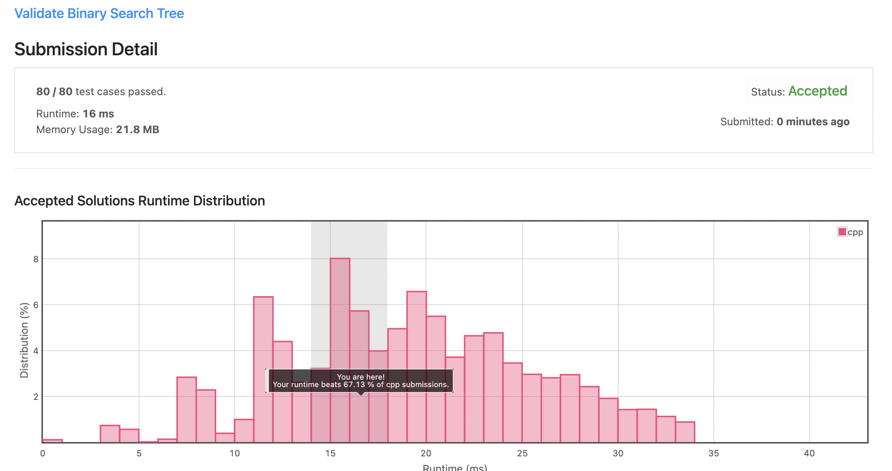
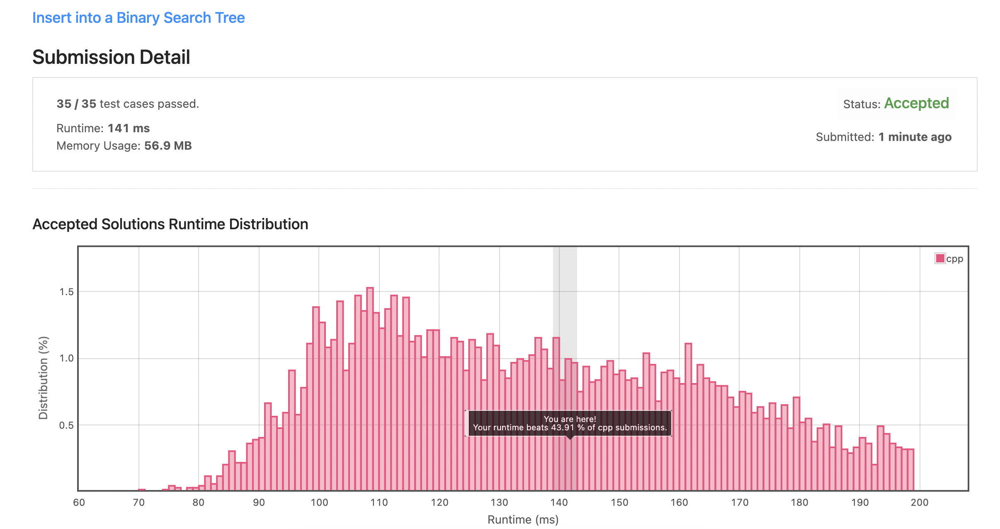
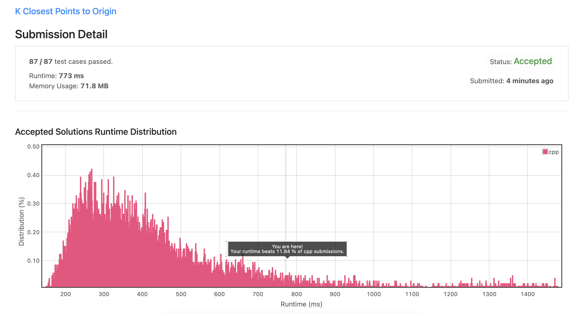

# Homework 2 - Mathew Rupp

## 5a 



All test cases passed

### Code
```
//Begin Solution
class Solution {
public:
    Node* connect(Node* root) {
        if(root == nullptr){
            return root;
        }
       
        //Tracker for size
        int sz;
        
        queue<Node*> q;

        //Enqueue the root node pointer
        q.push(root);
        

        while(!q.empty()){
            sz = q.size();
            
            //for loop for traversing across the level items
            for(int i = 0; i< sz; i++){;
                Node* cur = q.front();
                
                if(cur->left != nullptr){
                    //enqueue left subtree
                    q.push(cur->left);
                }
                //enqueue right subtree
                if(cur->right != nullptr){
                    q.push(cur->right);
                }
                //remove the next item
                q.pop();
                if(i < sz - 1){
                    //set the next current node pointer from the queue
                    cur->next = q.front();
            }
        }
        
    }
        return root;
        }
```

### References Used


[C++ Queue](https://cplusplus.com/reference/queue/queue/push/)

[Lecture Notes](https://jamboard.google.com/d/1fpIEp3VbXL_ZD4RurdS3yJ_u9Xm7S5nDFQfYcs7Na78/viewer?f=2)

## 5b 



All Test Cases passed

### Code
```
class Solution {
public:
    void flatten(TreeNode* root) {
        //Base Case
        if(root == nullptr){
            return;
        }
        
        TreeNode* leftChild = root->left;
        TreeNode* rightChild = root->right;
        
        root->left = nullptr;
        //Recursive Calls
        flatten(leftChild);
        flatten(rightChild);
        
        root->right = leftChild;
        
        TreeNode* ptr = root;
        //Walk the right side
        while(ptr->right != nullptr){
            ptr = ptr->right;
        }
        //Set the right child of the ptr
```

### References Used

[Lecture Notes](https://jamboard.google.com/d/1fpIEp3VbXL_ZD4RurdS3yJ_u9Xm7S5nDFQfYcs7Na78/viewer?f=0)

[Lecture Video](https://uw.hosted.panopto.com/Panopto/Pages/Viewer.aspx?id=611a3320-7965-4614-b532-aebe00492165)

## 5c  



All test Cases passed

### Code

```
class Solution {
public:
   
    TreeNode* buildTree(vector<int>& inorder, vector<int>& postorder) {
        if(postorder.empty()){    
            return nullptr;
        }   
       //The root node
        int postRoot = postorder.size()-1;		
       //construct a new tree with the root value at our postOrder index 
        TreeNode *tree = new TreeNode(postorder[postRoot]);		
        int i;
        int sz=inorder.size();:
        for(i=0; i<sz; i++)  	
            if(inorder[i]==postorder[postRoot]){
                break;
            } 
        //Construct subvector        
        vector<int> leftPost(postorder.begin(),postorder.begin()+i);
        
        vector<int> rightPost(postorder.begin()+i,postorder.end()-1);
        
        vector<int> leftInorder(inorder.begin(),inorder.begin()+i);
        vector<int> rightInorder(inorder.begin()+i+1,inorder.end());
        
        //recurse down left half
        tree->left = buildTree(leftInorder,leftPost);
        //recurse down right half
        tree->right = buildTree(rightInorder,rightPost);
        
        return tree;
    }

```

### References Used

[Vector Info](https://cplusplus.com/reference/vector/vector/?kw=vector)

[Video on the problem (different method than used)](https://www.youtube.com/watch?v=TblhNX9AQ3M)

## 5d 



All Tests Passed

### Code

```
class Solution {
public:
    bool isValidBST(TreeNode* root) {
        TreeNode* ptr = nullptr;
        return helper( root, ptr);
    }

    bool helper(TreeNode* root, TreeNode*& ptr){
        if( root == nullptr ){
            return true;
        }
        //left recursive calls    
        if( helper(root->left, ptr) == false ){
            return false;
        } 
        if( ptr != nullptr && ptr->val >= root->val ){
          return false;  
        } 
        
        ptr = root;
        //right recursive calls
        return helper( root->right, ptr);
    }
};
```

### References Used

[Lecture Video](https://uw.hosted.panopto.com/Panopto/Pages/Viewer.aspx?id=611a3320-7965-4614-b532-aebe00492165)

## 5e 



All Tests Passed

### Code

```
class Solution {
public:
    TreeNode* insertIntoBST(TreeNode* root, int val) {
        //if the root is null, create a new node with the value
         if (root == nullptr) {
             root = new TreeNode(val);
        } else {
             //otherwise, if the value is less than the current node value, move left
            if (val <= root->val) {
                root->left = insertIntoBST(root->left, val);
            // otherwise move right
            } else {
                root->right = insertIntoBST(root->right, val);
            }
        }
        return root;
    }
};

```

### References Used

[Lecture Video](https://uw.hosted.panopto.com/Panopto/Pages/Viewer.aspx?id=611a3320-7965-4614-b532-aebe00492165)

## 5f


All tests passed

### Code

```
class Solution {
public:
    TreeNode* deleteNode(TreeNode* root, int key) {
        if(root==nullptr){
            return nullptr;
        }
        //base case
        if(root->val == key){
            if(root->left == nullptr){
                return root->right;
            }
            if(root->right == nullptr){
                return root->left;
            }
            //temp node for finding inorder successor
            TreeNode* tmp;
            tmp = root->right;
            while(tmp->left != nullptr){
                tmp = tmp->left;
            }
            root->right = deleteNode(root->right,tmp->val);
            tmp->left = root->left;
            tmp->right = root->right;
            root = tmp;
        //move left
```

### References Used

For this one I had to look at the discussion forum...most of the solutions that were posted had the algorithm simply swapping the values, not the actual nodes. I used one of these to help me find whey my code was not moving as expected

[Leet Code Discussions For Problem](https://leetcode.com/problems/delete-node-in-a-bst/discuss/?currentPage=1&orderBy=newest_to_oldest&query=)

[This explination was the one I used to help me understand better](https://leetcode.com/problems/delete-node-in-a-bst/discuss/2209813/C%2B%2B-90-faster-solution-simple-code-with-comments)


## 5g


All Tests Passed
### Code

```
//Node class
class Node {
public:
    
    bool isWord;
    Node *leaves[26];
    
    Node() {
        isWord = false;
        
        for (int i = 0; i < 26; i++)
            leaves[i] = NULL;
    }
};

class Trie {
public:
    Trie() {
        root = new Node();
    }
   //iterate through string 
    void insert(string word) {
        int length = word.length();
        Node * tmp = root;
        for(int i = 0;i < length;i++){
          //97 is ascii character value;
            int j = word[i] - 97;
            if(tmp->leaves[j] == NULL){
                tmp->leaves[j] = new Node();
            }
            tmp = tmp->leaves[j];
        }
        //set the boolean value to true
        tmp->isWord = true;
    }
    
    bool search(string word) {
        Node *tmp = root;
        int length = word.length();
        for(int i = 0;i < length ;i++){
            int j = word[i] - 'a';
            if(tmp->leaves[j] == NULL)
                return false;
            tmp = tmp->leaves[j];
        }
        
        if(tmp->isWord){
            return true;
        }
        
        return false;
    }
    
    bool startsWith(string prefix) {
        Node *tmp = root;
        int length = prefix.length();
        for(int i = 0;i < length ;i++){
            int j = prefix[i] - 'a';
            if(tmp->leaves[j] == NULL)
                return false;
            tmp = tmp->leaves[j];
        }
        
        return true;
    }
    
    ~Trie() {
        clear(root);
    }

    Node *root;
    void clear(Node *tmp)
    {
        for(int i = 0;i < 26;i++)
        {
            if(tmp->leaves[i]){
                clear(tmp->leaves[i]);
            }
        }
        delete tmp;
    }
        
};
/**
 * Your Trie object will be instantiated and called as such:
 * Trie* obj = new Trie();
 * obj->insert(word);
 * bool param_2 = obj->search(word);
 * bool param_3 = obj->startsWith(prefix);
 */
```

### References

[Trie Data Structures](https://en.wikipedia.org/wiki/Trie#:~:text=In%20computer%20science%2C%20a%20trie,key%2C%20but%20by%20individual%20characters.)

[Trie insert and search](https://www.geeksforgeeks.org/trie-insert-and-search/)
## 5h 



All Tests Passed

## Code

```
class Solution {
public:
    vector<vector<int>> kClosest(vector<vector<int>>& points, int k) {
        
        vector<vector<int>> closest(k);
        //initialize heap
        
        priority_queue<vector<int> > heap;
        
        
        //populate heap
        for (auto& point : points) {
            int x = point[0], y = point[1];
            heap.push({x*x + y*y, x, y});
            if (heap.size() > k) {
                heap.pop();
            }
        }
        
        for (int i = 0; i < k; i++) {
            vector<int> max = heap.top();
            heap.pop();
            closest[i] = {max[1], max[2]};
        }
        
        return closest;
    }
};
```

### References
I ended up using the most references for this one. I learned a lot more about the C++ language, for example, range based for loops and the auto keyword.
[Ranged Based Loops C++](https://www.geeksforgeeks.org/range-based-loop-c/)

[priority_queue](https://cplusplus.com/reference/queue/priority_queue/)

[Pp Documentation](https://cplusplus.com/reference/algorithm/make_heap/?kw=make_heap)

[Solution 1](https://twchen.gitbook.io/leetcode/k-closest-points-to-origin)

[Solution Example 2](https://github.com/kamyu104/LeetCode-Solutions/blob/master/C%2B%2B/k-closest-points-to-origin.cpp)

[Auto Keyword](https://cplusplus.com/forum/general/103388/)
