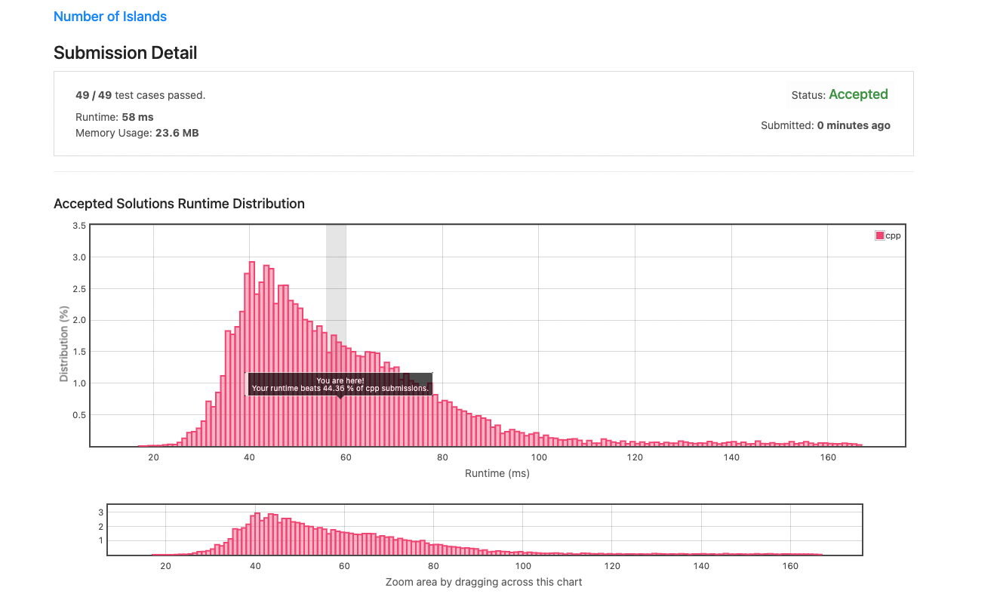
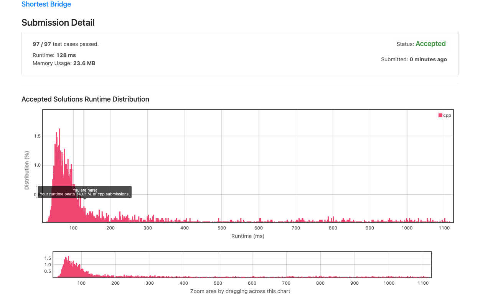
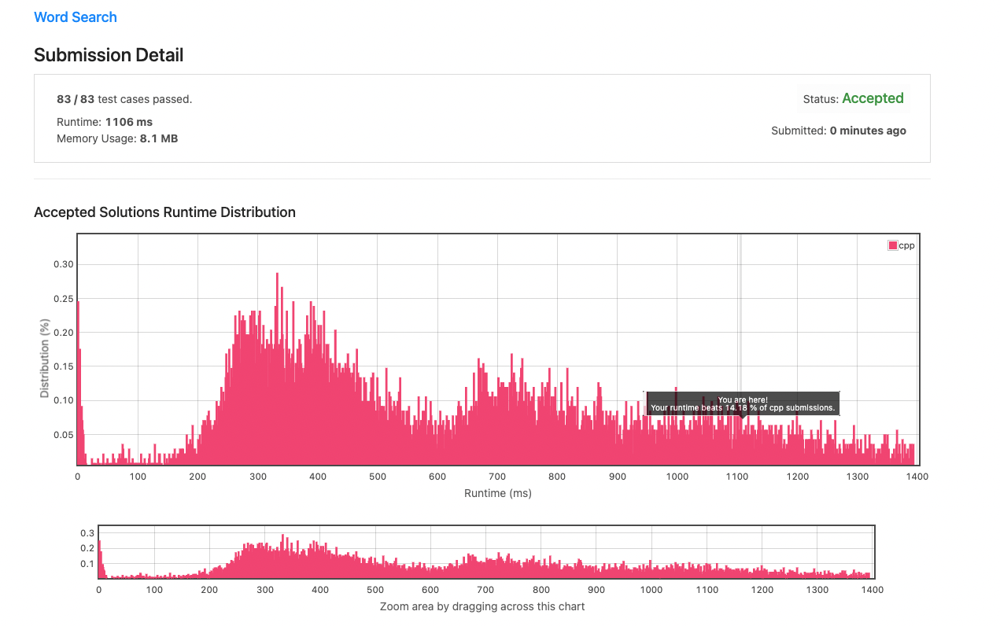
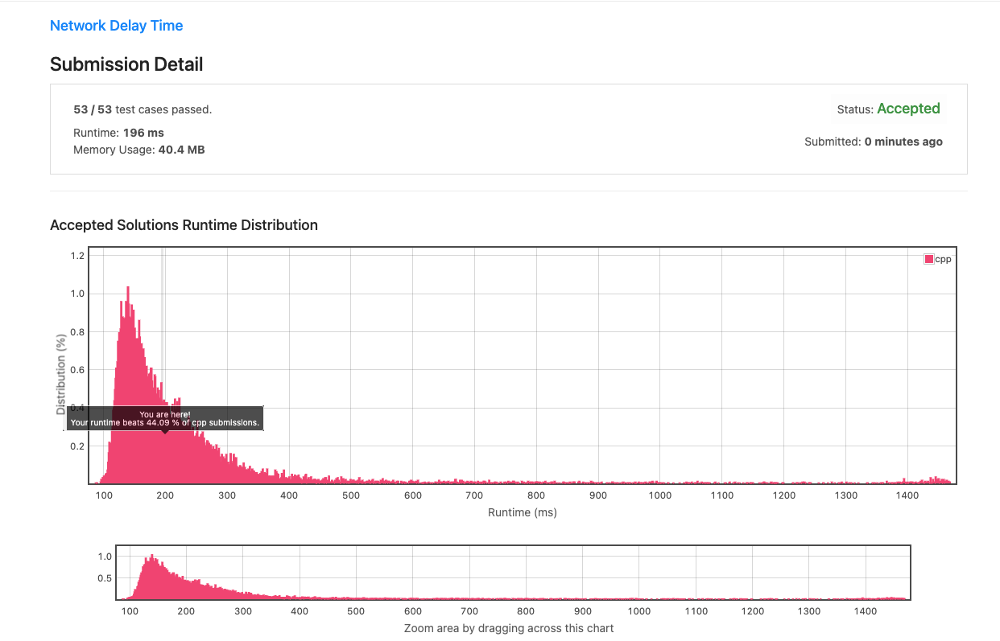
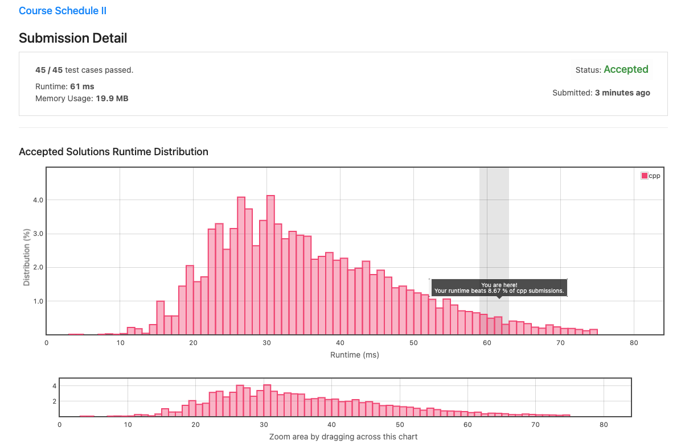

# Homework 3 

## Question 3a


### Did All Tests Pass?
Yes
### Code 
```
class Solution {
    //map for storing visited nodes
    map<Node*, Node*> visited;
    Node* depthFirst(Node* node) {
        if(node == NULL) {
            return node;
        }
        // if the node is already in visited, return that node
        if(visited.find(node) != visited.end()) return visited[node];
        
        // make a new node and copy the value
        Node* cloneNode = new Node(node->val);
        visited[node] = cloneNode;
        
        //iterate through neighbors
        for(Node* edges: node->neighbors) {
            cloneNode->neighbors.push_back(depthFirst(edges));
        }
        return cloneNode;
    }
public:
    Node* cloneGraph(Node* node) {
        Node* clone = depthFirst(node);
        return clone;
    }
};
```
### References

## Question 3b 


### Did All Tests Pass?
Yes
### Code 

```
class Solution {
public:
    //BFS Helper Function
    bool bfs(vector<vector<char>> *grid, int i, int j) {
        static const vector<pair<int, int>> directions{{0, 1}, {1, 0}, {0, -1}, {-1, 0}};
        
        if ((*grid)[i][j] == '0') {
            return false;
        }
        (*grid)[i][j] = '0';
        queue<pair<int, int>> q({{i, j}});
        while (!q.empty()) {
            const auto [a, b] = q.front(); q.pop();
            for (const auto& d : directions) {
                const auto first = a + d.first;
                const auto second = b + d.second;
                if (!(0 <= first && first < grid->size() &&
                      0 <= second && second < (*grid)[0].size() &&
                      (*grid)[first][second] == '1')) {
                    continue;
                }
                (*grid)[first][second] = '0';
                q.emplace(first,second);
            }
        }
        return true;
    }
    int numIslands(vector<vector<char>>& grid) {
        int count = 0;
        for (int i = 0; i < grid.size(); ++i) {
            for (int j = 0; j < grid[i].size(); ++j) {
                if (bfs(&grid, i, j)) {
                    ++count;
                }
            }
        }
        return count;
    }


};
```

## Resources Used
[Queue Methods](https://cplusplus.com/reference/queue/queue/emplace/)

## Question 3c


### Did All Tests Pass?
Yes
### Code 
```
class Solution {
public:
    int shortestBridge(vector<vector<int>>& grid) {
        
        int gridSize = grid.size();
        //create a double ended queue, q
        deque<pair<int,int>> q;
        for (int i = 0; i < gridSize; i++) {
            for (int j = 0; j < gridSize; j++) {
                if (grid[i][j] == 1) {
                    q.push_back({i, j});
                    break;
                }
            }
            if (!q.empty()){
                break;
            };
        }

        deque<pair<int, int>> points;
        set<pair<int, int>> visit;
        vector<int> dx = {0, 0, 1, -1};
        vector<int> dy = {1, -1, 0, 0};
        visit.insert(q.front());
        while (!q.empty()) {
            auto [a,b] = q.front();
            q.pop_front();
            for (int i = 0; i < 4; i++) {
                int x = a + dx[i];
                int y = b + dy[i];
                if (x >= 0 && x < gridSize && y >= 0 && y < gridSize) {
                    if (visit.count({x, y})) continue;
                    if (grid[x][y] == 0) points.push_back({x, y});
                    if (grid[x][y] == 1) q.push_back({x, y});
                    visit.insert({x, y});
                }
            }

        }

        int result = 1;
        int sz = points.size();
        while (sz > 0) {
            auto [a,b] = points.front();
            points.pop_front();
            sz--;
            for (int i = 0; i < 4; i++) {
                int x = a + dx[i];
                int y = b + dy[i];
                if (x >= 0 && x < gridSize && y >= 0 && y < gridSize) {
                    if (visit.count({x, y})) continue;
                    if (grid[x][y] == 0) points.push_back({x, y});
                    if (grid[x][y] == 1) return result;
                    visit.insert({x, y});
                }
            }
            if (sz == 0) {
                sz = points.size();
                result++;
            }
        }

        return result;
    }
};
```

### Resources
[Double Ended Queue](https://cplusplus.com/reference/deque/deque/?kw=deque)

[Shortest Bridge Explination](https://massivealgorithms.blogspot.com/2018/11/leetcode-934-shortest-bridge.html)

## Question 3d


### Did All Tests Pass?
Yes
### Code 
```
class Solution {
    public:
        bool exist(vector<vector<char> > &board, string word) {
            const int a = board.size();
            const int b = board.front().size();
            vector<vector<bool>> visited(a, vector<bool> (b, false) );
            for(int i = 0; i < a; ++i) {
                
                for(int j = 0; j < b; ++j) {
                    
                    if(dfs(board, word, 0,  i, j, visited))
                        return true;
                }
            }

            return false;
        }
    
        bool dfs(vector<vector<char> > &board, string word, int index, int i, int j,  vector<vector<bool> > &visited) {
            if(index == word.size()){
              return true;  
            }; 

            if(i < 0 || j < 0 
               || i >= board.size() 
               || j >= board.front().size()  
               || visited[i][j]
               || board[i][j] != word[index]){
                return false;
            };
                
            
            //Set visited 
            visited[i][j] = true;
            bool value = dfs(board, word, index + 1,  i + 1, j, visited) 
                || dfs(board, word, index + 1,  i, j + 1, visited) 
                || dfs(board, word, index + 1,  i - 1, j, visited) 
                || dfs(board, word, index + 1,  i, j - 1, visited);
            
            
            visited[i][j] = false;

            return value;
        }
};
```

### Resources
[Youtube Video On Python Solution](https://www.youtube.com/watch?v=pfiQ_PS1g8E)


## Question 3e


### Did All Tests Pass?
Yes
### Code 
```
class Solution {
public:
    int networkDelayTime(vector<vector<int>>& times, int N, int K) {
        using P = pair<int, int>;
        vector<vector<P>> adjacent(N);
        for (const auto& time : times) {
            int u;
            int v; 
            int w;
            
            tie(u, v, w) = make_tuple(time[0] - 1, time[1] - 1, time[2]);
            adjacent[u].emplace_back(v, w);
        }

        int result = 0;
        unordered_set<int> lookup;
        unordered_map<int, int> fastest;
        fastest[K - 1] = 0;
        priority_queue<P, vector<P>, greater<P>> min_heap;
        min_heap.emplace(0, K - 1);
        while (!min_heap.empty() && lookup.size() != N) {
            int u;
            tie(result, u) = min_heap.top(); min_heap.pop();
            lookup.emplace(u);
            if (fastest.count(u) &&
                fastest[u] < result) {
                continue;
            }
            for (const auto& point : adjacent[u]) {
                int v, w;
                tie(v, w) = point;
                if (lookup.count(v)) continue;
                if (!fastest.count(v) ||
                    result + w < fastest[v]) {
                    fastest[v] = result + w;
                    min_heap.emplace(result + w, v);
                }
            }
        }
        return lookup.size() == N ? result : -1;
    }
};
```

### Resources
[CPP Pair](https://cplusplus.com/reference/utility/pair/?kw=pair)

[Pair (Geeks for Geeks))](https://www.geeksforgeeks.org/pair-in-cpp-stl/)

[make_tuple](https://cplusplus.com/reference/tuple/make_tuple/)

[One Solution](https://www.youtube.com/watch?v=EaphyqKU4PQ)

[Another good video](https://www.youtube.com/watch?v=YHx6r9pM5e0)

## Question 3f


### Did All Tests Pass?
Yes
### Code 
```
class MedianFinder {
public:
   // Min Heap
    priority_queue<int, vector<int>, greater<int>> minHeap;
    // Max Heap
    priority_queue<int, vector<int>, less<int>> maxHeap;
    
    // insert
    void addNum(int num) {
        // Balance smaller half and larger half.
        if (maxHeap.empty() || num > maxHeap.top()) {
            minHeap.emplace(num);
            if (minHeap.size() > maxHeap.size() + 1) {
                maxHeap.emplace(minHeap.top());
                minHeap.pop();
            }
        } else {
            maxHeap.emplace(num);
            if (maxHeap.size() > minHeap.size()) {
                minHeap.emplace(maxHeap.top());
                maxHeap.pop();
            }
        }
    }

    // Find Median
    double findMedian() {
        double median;
        if(minHeap.size()==maxHeap.size()){
            median = (maxHeap.top() + minHeap.top()) / 2.0;
        }
        else{
            median = minHeap.top();
        } 
       return median;
        
    }


 
};
```

### Resources
[Priority Queue C++](https://cplusplus.com/reference/queue/priority_queue/)

## Question 3g


### Did All Tests Pass?
Yes
### Code
```
class Solution {
public:
    vector<int> findOrder(int numCourses, vector<vector<int>>& prerequisites) {
        unordered_map<int, unordered_set<int>> inDeg, edge;
        for (const auto& prereq : prerequisites) {
            inDeg[prereq[0]].emplace(prereq[1]);
            edge[prereq[1]].emplace(prereq[0]);
        }
        //construct queue
        queue<int> q;
        for (int i = 0; i < numCourses; i++) {
            if (!inDeg.count(i)) {
                q.emplace(i);
            }
        }
        
        vector<int> result;
        while (!q.empty()) {
            const auto node = q.front(); q.pop();
            result.emplace_back(node);
            for (const auto& i : edge[node]) {
                inDeg[i].erase(node);
                if (inDeg[i].empty()) {
                    q.emplace(i);
                    inDeg.erase(i);
                }
            }
            edge.erase(node);
        }
       
        if(inDeg.empty() == true && edge.empty()==true){
           return result;
        }
        else{
            return vector<int>();
        }
        
    }
};
```
### Resources
[Topological Sorting Geeks For Geeks](https://www.geeksforgeeks.org/topological-sorting/)

[Vector Emplace](https://cplusplus.com/reference/vector/vector/emplace/)

