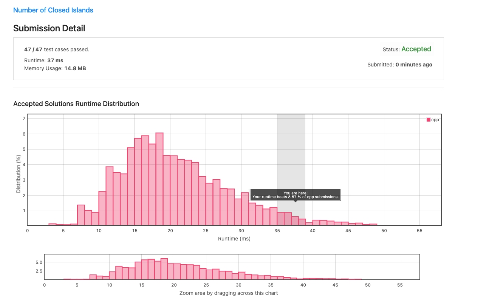

# Homework 3 

## Question


### Did All Tests Pass?
Yes
### Code 
```
class Solution {
    //map for storing visited nodes
    map<Node*, Node*> visited;
    Node* depthFirst(Node* node) {
        if(node == NULL) {
            return node;
        }
        // if the node is already in visited, return that node
        if(visited.find(node) != visited.end()) return visited[node];
        
        // make a new node and copy the value
        Node* cloneNode = new Node(node->val);
        visited[node] = cloneNode;
        
        //iterate through neighbors
        for(Node* edges: node->neighbors) {
            cloneNode->neighbors.push_back(depthFirst(edges));
        }
        return cloneNode;
    }
public:
    Node* cloneGraph(Node* node) {
        Node* clone = depthFirst(node);
        return clone;
    }
};
### References
## Question 3b 

```
### Did All Tests Pass?

### Code 


### Did All Tests Pass?
Yes
### Code 
```
class Solution {
public:
    //BFS Helper Function
    bool bfs(vector<vector<char>> *grid, int i, int j) {
        static const vector<pair<int, int>> directions{{0, 1}, {1, 0}, {0, -1}, {-1, 0}};
        
        if ((*grid)[i][j] == '0') {
            return false;
        }
        (*grid)[i][j] = '0';
        queue<pair<int, int>> q({{i, j}});
        while (!q.empty()) {
            const auto [a, b] = q.front(); q.pop();
            for (const auto& d : directions) {
                const auto first = a + d.first;
                const auto second = b + d.second;
                if (!(0 <= first && first < grid->size() &&
                      0 <= second && second < (*grid)[0].size() &&
                      (*grid)[first][second] == '1')) {
                    continue;
                }
                (*grid)[first][second] = '0';
                q.emplace(first,second);
            }
        }
        return true;
    }
    int numIslands(vector<vector<char>>& grid) {
        int count = 0;
        for (int i = 0; i < grid.size(); ++i) {
            for (int j = 0; j < grid[i].size(); ++j) {
                if (bfs(&grid, i, j)) {
                    ++count;
                }
            }
        }
        return count;
    }


};
```

## Resources Used
[Queue Methods](https://cplusplus.com/reference/queue/queue/emplace/)

## Question 3c


### Did All Tests Pass?

### Code 

## Question 3d


### Did All Tests Pass?

### Code 

## Question 3e


### Did All Tests Pass?

### Code 

## Question 3f


### Did All Tests Pass?

### Code 

## Question 3g


### Did All Tests Pass?

### Code 

