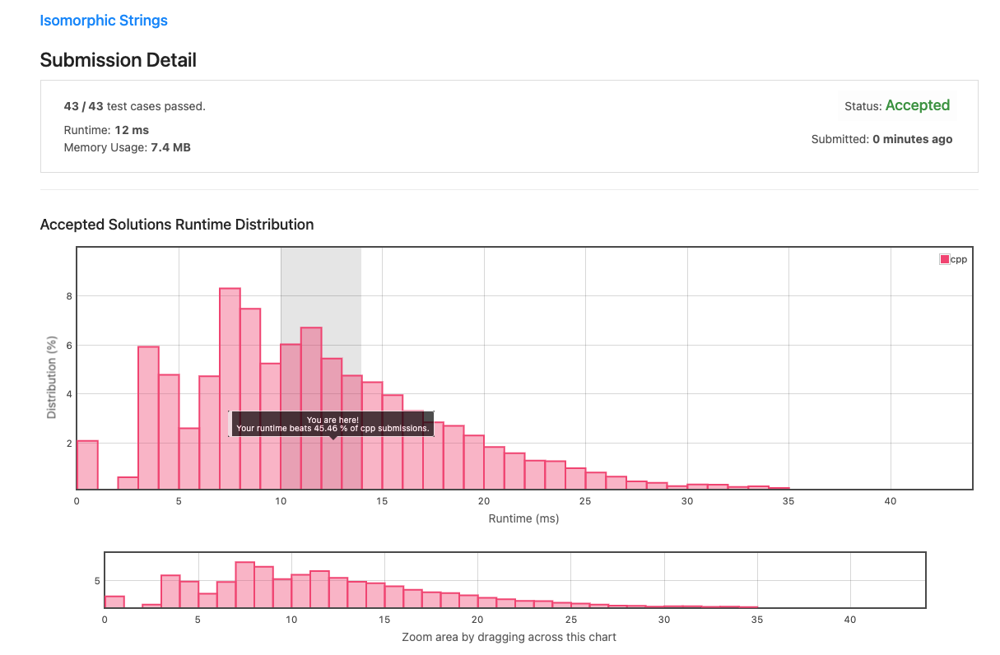

# HW4
---
## Problem 5a


### Code

```
class Solution {
public:
    int minCostConnectPoints(vector<vector<int>>& points) {
        //cost of Minimum Spanning Tree
        int cost = 0;
        //integer for iterating through point set
        int p = 0;
        
        vector<int> distance(points.size(), INT_MAX);
        
        //a data structure for tracking which points we've visited
        unordered_map<int,int> visited;
        
        for (int i = 0; i < points.size() - 1; i++) {
            int x = points[p][0]; 
            int y = points[p][1];
            
            visited.emplace(p,p);
            
            
            for (int j = 0; j < points.size(); j++) {
                if (visited.count(j) > 0) {
                    //we've already visited U.
                    continue;
                }
                //Compare element J distance to the absolute value of x-x1 and y-y1 and return the min to element j
                distance[j] = min(distance[j], abs(points[j][0] - x) + abs(points[j][1] - y));
            }
            
            int dist = INT_MAX;
            
            for (int i = 0; i < distance.size(); i++) {
                if (distance[i] < dist) {
                    dist = distance[i];
                    p = i;
                }
            }
            //set the distance on points we've added
            distance[p] = INT_MAX; 
            // add the distance to the cost of our MST
            cost += dist;
        }
        return cost;
    }
};
```

### Resources
[One Leetcode Solution with Primms](https://leetcode.com/problems/min-cost-to-connect-all-points/discuss/1311499/Easy-Prim's-Approach-C%2B%2B)

[Youtube Video on Python Approach](https://www.youtube.com/watch?v=f7JOBJIC-NA)


## Problem 5b 



All tests passed

### Code
```
class Solution {
public:
    bool isIsomorphic(string s, string t) {
        //if the lengths are not equal, they cannot be isomorphic
        if(t.length() != s.length()) return false;
        
        int maxLength = 50000; //5*10^4
        //an array for s to t (could also use vector)
        int st[maxLength];
        // an array for t to s
        int ts[maxLength];
        
        // instantiate each array slot to 0;
        for(int i = 0; i<maxLength; i++){
            st[i] = 0;
            ts[i] = 0;
        }
        
        
        //could also use t.length since they are equivelent
        //We're typecasting char to int and creating our own map
        for (int i = 0; i < s.length(); i++) {
            
            if (st[s[i]] == 0 && ts[t[i]] == 0) {
                
                st[s[i]] = t[i];
               

                ts[t[i]] = s[i];
                
            } else if (st[s[i]] != t[i]) return false;
            
            
        }
        

        return true;
    }
};
```

### Resources
[LeetCode ](https://leetcode.com/problems/isomorphic-strings/discuss/2363616/Easy-solution-w-Explanation-or-Hash-Map)


